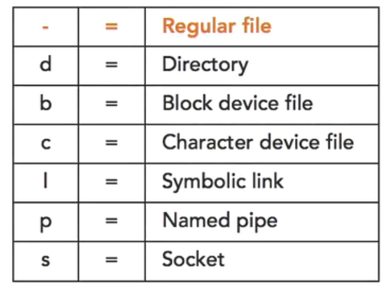

# Linux Files and Permissions

This is a summary of the Linux's files and permissions.

## Practical Example
With the knowledge, one could limit other users from accessing your data.
For example, if you have two users in a system, `user1` and `user2`.
`user1` could change its home directory permission to `700` so that only
he or she is able to access it.

```bash
sudo chmod 700 /home/user1
```

**View File Permission**:  
```bash
stat -c "%a %n" filename
# stat -c "%a %n" 3d_lidars_2024-11-12-17-13-10_0.bag
# 755 3d_lidars_2024-11-12-17-13-10_0.bag
```

## File

Type | ll
--- | ---
Directory | drwxrwxr-x  3 chanjl chanjl  4096 Jun  5 15:37 linux-files-and-permissions
Regular File | -rw-rw-r--  1 chanjl chanjl  4366 May  1 19:04 .tmux.conf
Symbolic Link | lrwxrwxrwx  1 root root       4 Apr 15 19:04 rnano -> nano
Block Device File (Harddrives and USBs) | brw-rw---- 1 root disk 8, 0 Jun  5 13:44 ../sda
Socket File (Facilitates communication between applications) | srw-rw-rw-. 1 root root       0 Feb 2 18:58 log
Named Pipe File (FIFO) | prw-------. root root 0 Feb 2 18:58 /run/dmeventd-client



### Metadata of a File
Data that describes other data are called metadata.
- File name  
- File size  
- Permissions  
- Ownership  
- Last access time  

ls -l | Explanation
--- | ---
`-`rw-r--r--. 1 root root 2315 Sep 12 14:39 /etc/passwd | First column explains the type of file
-`rw-`r--r--. 1 `root` root 2315 Sep 12 14:39 /etc/passwd | Second to fourth columns is the user owner permissions (here is root)
-rw-`r--`r--. 1 root `root` 2315 Sep 12 14:39 /etc/passwd | Fifth to seventh columns is the group owner permissions (here is root group)
-rw-r--`r--`. 1 root root 2315 Sep 12 14:39 /etc/passwd | Eighth to tenth columns is the other permision (here is others only have read access)
-rw-r--r--`.` 1 root root 2315 Sep 12 14:39 /etc/passwd | This is the Index Filesystem nodes or Inodes. An Inode stores the metadata of the file (most regular files only have one Inode)
-rw-r--r--. 1 `root` root 2315 Sep 12 14:39 /etc/passwd | User owner, one file can only have one user owner
-rw-r--r--. 1 root `root` 2315 Sep 12 14:39 /etc/passwd | Group owner, one file can only have one group owner
-rw-r--r--. 1 root root `2315` Sep 12 14:39 /etc/passwd | File size in bytes
-rw-r--r--. 1 root root 2315 Sep 12 14:39 `/etc/passwd` | The name of the file

Note that every file is owned by one user owner and one group owner.  
There multiple ways to display the metadata of a file.  
**Method 1**
```bash
file /etc/passwd
```
**Method 2**
```bash
stat /etc/passwd
```

### Extended Attribute Types
1. Extended security attributes
2. Extended system attributes
3. Extended user attributes

**Extended security attributes:**
SElinux security context
- A mandatory access control (MAC) system
- Layered over the Linux discretionary access control (DAC) system
**Method 1**  
```bash
ls -Z /etc/passwd
```

**Extended system attributes**
Access control lists
- Additional layer of discretionary permissions
- Permissions for multiple users on a file
- Permissions for multiple groups on a file
- Inheritance for user/group permissions
- Backing up and restoring permissions
**Method 1**
```bash
# Create a text file
touch aclfile.txt
# See the permissions
ls -l aclfile.txt
# Set acl attribute and allow root to have rwx rights on text file
setfacl -m user:root:rwx aclfile.txt
# View acl attribute on text file
getfacl -t aclfile.txt
```

**Extended user attributes**
Extended attributes
- Append only (Can add data to the file but not overwrite the original)
- Auto compress files (Set this attribute to compress and decompress automatically)
- Make files immutable (If the immutable flag is set means cannot be modified, deleted, renamed, no data can be written to the file)
- Auto backup on single files (If the backup flag is set means when it is deleted, it can be undelete because it is backup, which is not default by Linux)
**Method 1**
```bash
# Create a text file
touch afile.txt
# Change attribute for text file(need to elevate privilages to set the attribute)
# +i for immutable flag
sudo chattr +i afile.txt
# List attribute for text file
lsattr afile.txt
```

### File Globbing

File Glob | Explanation | Examples
--- | --- | ---
Asterisk * | Matches with any number of any characters | `file.*` --> file.txt, file.jpg, file.tar.gz
Question Mark ? | Matches with any one of the characters | `??.txt` --> 12.txt, 34.txt; `???.jpg` -- > hal.jpg, 123.jpg
Character Sets [] | Matches one character in the list | `file[0-9].txt` --> file1.txt, file8.txt; `file[abc123].jpg` --> filea.jpg, file3.jpg
Hyphen - | Matches a hyphen | `file[-0-9].txt` --> file-.txt, file1.txt
Negates ! | Negates a match | `file[!0-9].txt` --> filea.txt, fileb.txt but not file1.txt
Digit [:digit:] | Matches numbers | `file[[:digit:]].txt` --> file1002432.txt 
Uppercase [:upper:] | Matches uppercase characters | `file[[:upper:]]` --> fileXX.txt
Lowercase [:lower:] | Matches lowercase characters | `[:lower:]`
Alphabets (upper or lower) [:alpha:] | Matches upper and lower case characters | `[:alpha:]`
Alphabets and Numbers [:alnum:] | Matches upper, lower case characters and numbers | `[:alnum:]`
Spaces Tabs Newlines [:space:] | Matches spaces, tabs, newlines | `[:space:]`
Graph [:graph:] | Matches printable characters not including spaces | `[:graph:]`
Print [:print:] | Matches printable characters including spaces | `[:print:]`
Punctuation [:punct:] | Matches punctuation | `[:punct:]`
Non-printable [:cntrl:] | Matches non-printable control characters | `[:cntrl:]`
Hexadecimal Characters [:xdigit:] | Matches hexadecimal characters | `[:xdigit:]`

**Method 1**  
```bash
ls file[0-9].txt
```
**Method 2**  
```bash
ls file[[:digit:]].txt
```
**Method 3**  
```bash
ls file[[:xdigit:][:space:]].txt
```
**Method 4**
```bash
ls file[![:digit:]].txt
```

### File Globbing: Brace Expansion  
```bash
# Command
ls {*.jpg, *.gif, *png}
# Result
a.jpg
b.jpg
c.gif
d.png
```

### File Globbing: Extended Glob
```bash
# To check if Extended Glob is turn on
# Shell options, and look for extglob
shopt | grep extglob
# To turn on Extended Glob
shopt -s extglob
```

**Advantages**  
- Specify the number of matches  
- Allow grouping matches  
- Patterns can be more than one character  
- Logical OR

**Method 1**  
`?(match)` | 0 or 1 occurrence of pattern match  
```bash
# Example command
ls | grep file?(abc).txt
# Result
file.txt
fileabc.txt
```
**Method 2**  
`+(match)` | 1 or more occurrences of pattern match  
```bash
# Example command
ls file+(abc).txt
# Result
fileabc.txt
fileabcabc.txt
```
**Method 3**  
`+(match1|match2)` | match one or the other pattern  
```bash
# Example command
ls +(*.jpg|*gif)
# Result
photo.jpg
file.jpg
photo.gif
file.gif
```
**Method 4**  
`*(match)` | 0 or more occurrences of pattern match
```bash
# Example command
ls photo*(abc).jpg
# Result
photo.jpg
photoabc.jpg
photoabcabc.jpg
```
**Method 5**  
`!(match)` | invert the pattern match  
```bash
# Example command
ls !(*.jpg|*.gif)
# Result
file.txt
fileabc.txt
fileabcabc.txt
```
**Method 6**  
`!(+(match)*+(match))` | group pattern matches  
```bash
# Example command
ls !(+(photo|file)*+(.jpg|.gif))
# Result
All files that do not start with photo or file and do not end with .jpg or .gif
```

### Creating Links
**Hard Link**
Linking file with hard link mean these files will the exactly the same. They behave linke smartpointers, only when all pointers are destroyed are then the memory is freed. You can verify by the Inode which for regular file should be 1.
```bash
# Example
touch file.txt
# Hard link file.txt
ln file.txt filelink.txt
# View inode
ll
# Result
-rw-rw-r--  2 chanjl chanjl     0 Jun  6 15:06 filelink.txt
-rw-rw-r--  2 chanjl chanjl     0 Jun  6 15:06 file.txt
# Another way to view
stat file.txt
# Result
  File: 'file.txt'
  Size: 0               Blocks: 0          IO Block: 4096   regular empty file
Device: 10305h/66309d   Inode: 5512893     Links: 2
Access: (0664/-rw-rw-r--)  Uid: ( 1000/  chanjl)   Gid: ( 1000/  chanjl)
Access: 2020-06-06 15:06:29.312064233 +0800
Modify: 2020-06-06 15:06:29.312064233 +0800
Change: 2020-06-06 15:06:39.236064439 +0800
 Birth: -
```
**Disadvantages**  
- Cannot link to directories  
- Cannot link across filesystems  
- Hard to identify  
**Advantages**  
- Take up virtually no space  
- Do not break when target is deleted  

**Symbolic Link**
Symbolic linke is a file that points to another file.  
```bash
# Example
touch file.txt
# Symbolick link file.txt
ln -s file.txt filesymlink.txt
# View metadata of the file.txt
ll
# Result
lrwxrwxrwx  1 chanjl chanjl     8 Jun  6 15:15 filesymlink.txt -> file.txt
# Another way to view
stat filesymlink.txt
# Result
  File: 'filesymlink.txt' -> 'file.txt'
  Size: 8               Blocks: 0          IO Block: 4096   symbolic link
Device: 10305h/66309d   Inode: 5512991     Links: 1
Access: (0777/lrwxrwxrwx)  Uid: ( 1000/  chanjl)   Gid: ( 1000/  chanjl)
Access: 2020-06-06 15:15:25.936075388 +0800
Modify: 2020-06-06 15:15:25.932075388 +0800
Change: 2020-06-06 15:15:25.932075388 +0800
 Birth: -
```
**Disadvantages**  
- Take up a small amount of space  
- Break if the target is deleted  
**Advantages**
- Can link across filesystems  
- Can link to directories  
- Easy to identify (ls -l)  

### Standard Linux Permissions Overview
**Features of Standard Linux Permissions**  
- Users can belong to multiple groups (group cannot contain other group)  
- Files belong to one user owner  
- Files belong to one group owner  
- Permissions can be set for the user, group, or other  

**Features of Standard Linux**  
- Users can read, write, or execute files  
- Users can list, create new files and traverse directories  
- Permissions support privilege escalation  
- Permissions support group owner inheritance  
- They support default file permissions  

**Shortfalls of Standard Linux Permissions**  
- Files and directories can only belong to one user  
- Files and directories can only belong to one group  
- Permissions set for other are not concise  
- Inheritance only support group ownership and not permissions  
- There is no easy way to back up and restore permissions  
- There is no easy way to temporarily restrict permissions  

### File Ownership
The command to change the ownership of a file is `chown`.  
`chown [options] <user>:<group> <file>`
**Method 1**  
```bash
# Example
sudo chown bob file.txt
# Explanation
Setting user ownership to bob
```
**Method 2**  
```bash
# Example
sudo chown :bobgroup file.txt
# Explanation
Setting group ownership to bobgroup
```
**Method 3**  
```bash
# Example
sudo chown -r bob:bobgroup /home/bob
# Explanation
Setting every file inside /home/bob directory to bob:bobgroup ownership
Note that user and group need to exist before you can set them
# To add user
sudo useradd testuser
# To view user
cat /etc/passwd
# To add group
sudo groupadd testgroup
# To view group
cat /etc/group
```

### File Permissions in Numeric Mode
The command to set the permission of a file is `chmod`.  
`chmod [options] <permissions> <filename>`  

Command | Equals | Value
--- | --- | ---
Read | = | 4
Write | = | 2
Execute | = | 1

Therefore, `rwx` means `4 + 2 + 1 = 7`  

**Method 1**  
```bash
# First create a file
touch file.txt
# View permission
ls -l
# Result
-rw-rw-r-- 1 chanjl chanjl     0 Jun  6 15:45 file.txt
# Lets change to permission
chmod 750 file.txt
# View permission
ls -l
# Result
-rwxr-x--- 1 chanjl chanjl     0 Jun  6 15:45 file.txt
```

### File Permissions in Numeric Mode
The command to set the permission of a file is `chmod`.  
`chmod [options] <permissions> <filename>`  

Who | Representation | Examples
--- | --- | ---
User | u | u=rwx; u=rx; u+rwx
Group | g | g=rw; g+rwx; g-w
Other | o | o=rwx; o=; o-x

**Method 1**  
```bash
# Example
chmod a-x file.txt
# Explanation
Take away executable permission for all (user, group, other
```
**Method 2**  
```bash
# Example
chmod ugo+x file.txt
# explanation
Add executable permission for all (user, group, other)
```

### UMask (Default Permission)
The default permission when files are create are called `umask`.  

**To view umask**  
```bash
# To view umask
umask
# Result
0002
# Another way
umask -S
# Result
u=rwx,g=rwx,o=rx
```

Symbolic | Numeric | Description
--- | --- | ---
rwxrwxrwx | 777 | Maximum initial permissions for directories
rw-rw-rw | 666 | Maximum initial permissions for files

To understand umask result, we do this.  
Take the maximum permission minus the output.  
`777 - 002 = 775` or `rwxrwxr-x` | for directory  
`666 - 002 = 664` or `rw-rw-r--` | for files (due to safety reasons)

### Special file bits: SUID and SGID

The SUID bit elevates privileges to the file's owner when executed. The SGID bit elevates privileges to the file's group owner when executed. 

Special Bits | Equal | Numeric
--- | --- | ---
SUID | = | 4
SGID | = | 2
Sticky | = | 1

SUID: Regular user like Bob executes `sudo` will get the priviledge of `root`.  
SUID: Runs as the user owner.  
```bash
# Example
ls -l /usr/bin/sudo
# Result
-rwsr-xr-x 1 root root 136808 Feb  1 02:37 /usr/bin/sudo
# Explanation
The `s` here means executable permission is set, if it is `S` capital means it is not set which is the only way to know if it is set or unset.  
```

**Set SUID Permission**  
```bash
# Method 1
chmod 4755 /usr/bin/su
# Method 2
chmod u+s /usr/bin/su
```
**Set SGID Permission**  
```bash
# Method 1
chmod 2755 /usr/bin/screen
# Method 2
chmod g+s /usr/bin/screen
```
**Looking for SUID Permission Files**  
```bash
sudo find / -perm -4000
```
**Looking for SGID Permission Files**  
```bash
sudo find / -perm -2000
```

### Sticky
SGID and sticky are special bits for directories.  
**Example 1: SGID**
```bash
# Create a directory with sudo
sudo mkidr accounting
# View metadata
ls -l
# Result
drwxr-xr-x  2 root   root    4096 Jun  6 17:19 accounting
# Create a group called accounting
sudo addgroup accounting
# Result
Adding group `accounting` (GID 1002) ...
Done.
# Change the owner permission
sudo chown :accounting accounting/
# View metadata
ls -l
# Result
drwxr-xr-x 2 root   accounting  4096 Jun  6 17:19 accounting
# Let's add SGID for the directory
sudo chmod 2770 accounting/
# View metadata
ls -l
# Result
drwxrws--- 2 root   accounting  4096 Jun  6 17:19 accounting
# Create user bob under accounting group
sudo useradd -G accounting bob
# Create a passwd for bob
sudo passwd bob
# Login as bob
su - bob
# Source my .bashrc (To display things better)
. /home/chanjl/.bashrc
# Go to the directory
cd /home/chanjl/accounting
# Create file
touch file.txt
# View metadata
ls -l
# Result
-rw-rw-r-- 1 bob accounting 0 Jun  6 18:18 file.txt
# Explanation
You can see that only those under the accounting group can
```
Anyone who creates a file inside this directory `accounting` will have group permission of `accounting`.  
However, note that that person who wishes to create a file in the directory must belong under the accounting group.  
Else, he will not even be able to cd into the directory.  

**Example 2: Sticky**  
```bash
# Create a directory with sudo
sudo mkdir stickydir
# View metadata
ls -l
# Result
drwxr-xr-x 2 root   root    4096 Jun  6 19:06 stickydir
# Change the permission
sudo chmod 1777 stickydir/
# View metadata
ls -l
# Result
drwxrwxrwt 2 root   root    4096 Jun  6 19:06 stickydir
# Explanation
The `t` at the end prevents other user from modifying, renaming and deleting your file
# Create a file inside the directory
touch stickydir/file.txt
# Change permission of the file so that anyone can delete it
chmod 777 stickydir/file.txt
# View metadata
ls -l
# Result
-rwxrwxrwx 1 chanjl chanjl 0 Jun  6 19:09 file.txt
# Let's go to bob and try to delete it
su - bob
# Source my own .bashrc
cd /home/chanjl
. .bashrc
# Delete file
cd stickydir
rm file.tx
# Result
rm: cannot remove 'file.txt': Operation not permitted
# To remove them use sudo 
```

The sticky bit is generally use for shared directories like /tmp

### Access Control List (ACL)
**Advantages**  
- Permissions can be set for multiple users  
- Permissions can be set for multiple groups  
- User and group permissions can be inherited  
- There is easy backup and restore of permissions  
- There is easy temporary restriction of permissions  

**Disadvantages**  
- Not always installed  
- Not build into Linux  
- Can be turned off  
- Uses new, unfamiliar commands  

**Example 1**
```bash
# Create a directory and a file
mkdir aclexercise
cd aclexercise
touch aclfile
# View metadata
ls -l
# Result
-rw-rw-r-- 1 chanjl chanjl 0 Jun  6 21:23 aclfile
# View acl information
getfacl aclfile
# Restul
# file: aclfile
# owner: chanjl
# group: chanjl
user::rw-
group::rw-
other::r--

# Another way to view acl information
getfacl -t aclfile
# Result
# file: aclfile
USER   chanjl    rw-     
GROUP  chanjl    rw-     
other            r--     

# Set acl permission, -m for modify
setfacl -m user:root:rwx aclfile
# View metadata
ls -l
# Result (notice the + at the end)
-rw-rwxr--+ 1 chanjl chanjl 0 Jun  6 21:23 aclfile
# View acl information
getfacl aclfile
# Result
# file: aclfile
# owner: chanjl
# group: chanjl
user::rw-
user:root:rwx
group::rw-
mask::rwx
other::r--

# Explanation
Notice the root has been added as a user
And there is a mask row which states the highest allowed permission
```

Use `man getfacl` and `man setfacl` for more information.

Using the acl command:  
`sudo setfacl -m user:<username>:<permissions> <file>`  
`sudo setfacl -m group:<groupname>:<permissions> <file>`  
**Examples**  
`sudo setfacl -m user:bob:rwx /home/file.txt`  
`sudo setfacl -m group:accounting:rx file.txt`  
`sudo setfacl -m user:bob:rwx,group:accounting:rx file.txt`  
`sudo setfacl -m u:bob:rwx,g:accounting:rx file.txt`  
`sudo setfacl -m user::rwx file.txt` = `sudo chmod u=rwx file.txt`  

**Example 2**  
```bash
# Create a directory with sudo
sudo mkdir dir1
# Create files inside
sudo touch dir1/file{01..10}.txt
# Set permission for bob to access directory
sudo setfacl -m u:bob:rwx dir1/
# View acl information
getfacl dir1/
# Result
# file: dir1/
# owner: root
# group: root
user::rwx
user:bob:rwx
group::r-x
mask::rwx
other::r-x

# Set permission for bob to access all the files inside directory
sudo setfacl -R -m u:bob:rwx dir1/
# View metadata of all files inside dir1/
sudo ls -l dir1/
# Result
total 0
-rw-rwxr--+ 1 root root 0 Jun  6 21:58 file01.txt
-rw-rwxr--+ 1 root root 0 Jun  6 21:58 file02.txt
-rw-rwxr--+ 1 root root 0 Jun  6 21:58 file03.txt
-rw-rwxr--+ 1 root root 0 Jun  6 21:58 file04.txt
-rw-rwxr--+ 1 root root 0 Jun  6 21:58 file05.txt
-rw-rwxr--+ 1 root root 0 Jun  6 21:58 file06.txt
-rw-rwxr--+ 1 root root 0 Jun  6 21:58 file07.txt
-rw-rwxr--+ 1 root root 0 Jun  6 21:58 file08.txt
-rw-rwxr--+ 1 root root 0 Jun  6 21:58 file09.txt
-rw-rwxr--+ 1 root root 0 Jun  6 21:58 file10.txt
# Set dir1 to give rwx permissions for future files created in dir1
sudo setfacl -d -m u:bob:rwx dir1/
# View acl information
getfacl dir1/
# Result
# file: dir1/
# owner: root
# group: root
user::rwx
user:bob:rwx
group::r-x
mask::rwx
other::r-x
default:user::rwx
default:user:bob:rwx
default:group::r-x
default:mask::rwx
default:other::r-x

# Explanation
Notice that the default user bob has rwx permission.
# Test it by creating a file
sudo touch dir1/text123.txt
# View acl information
getfacl dir1/text123.txt
# Result
# file: dir1/text123.txt
# owner: root
# group: root
user::rw-
user:bob:rwx                    #effective:rw-
group::r-x                      #effective:r--
mask::rw-
other::r--

# Explanation
Notice that bob is a user with rwx permission
However the mask permission is rw-, hence, bob only has rw- at max permission
```

### Deleting ACL

Flag | Explanation
--- | ---
-x | Remove specific ACL
-k | Remove all default ACLs
-b | Remove all ACLs

**Examples**  
`setfacl -x u:root acldeldir/`  
`setfacl -x root acldeldir`, if you do not specify anything, by default, it is user  
`setfacl -x default:user:root acldeldir`, to delete default ACL  
`setfacl -d acldeldir`, to delete all default ACLs  
`setfacl -b acldeldir`, to delete all ACLs  

### Random ACL Tricks

**Example 1: Setting File2 to have File1 ACL Settings**  
```bash
mkdir dir1
cd dir1/
touch file{1,2}.txt
# Set ACL for every file
setfacl -R -m u:root:rwx .
# View acl information
ls -l
# Result
-rw-rwxr--+ 1 chanjl chanjl 0 Jun  6 22:17 file1.txt
-rw-rwxr--+ 1 chanjl chanjl 0 Jun  6 22:17 file2.txt
# For file2 to have file1 acl settings
getfacl file1.txt | setfacl --set-file=- file2.txt
```
**Example 2: Setting ACL Settings from a textfile**  
```bash
# Save acl information from file1.txt to acls.txt
getfacl -c file1.txt > acls.txt
# Set acl from acls.txt
setfacl -M acls.txt file1.txt
```
**Example 3: Set the entire folder ACL Settings from a file**  
```bash
# Save acl settings from folder
getfacl -R dir1 > dir1tree.facl
# Restore acl settings
setfacl --restore dir1tree.facl
```
**Example 4: Setting mask**  
```bash
# Set mask to no permission
setfacl -m mask::- dir1
# Unset mask to rwx permission
setfacl -m mask::rwx dir1
```
